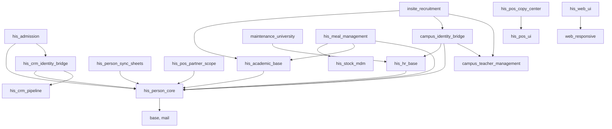

# Annex: structure, complexity and over-engineering

## Module dependency graph (this repo's modules only)

**Healthy:**
- No cycles.
- `his_person_core` is the single foundation layer, and the bridges (`*_identity_bridge`) point the right way: the business module does not know about identity, the bridge knows both.

**Coupling to watch:** `his_meal_management -> his_stock_mdm`.
- It was added on 2026-09-09 against the module's own earlier design note.
- It makes the meal wallet impossible to install on a fresh database without the stock category tree (see finding D-1 in the report).

## Size

| Measure | Value |
|---|---|
| Python, all | 26,151 lines (17,475 source lines) |
| Python, business modules only (no tests or tools) | about 17,200 lines |
| XML | 12,020 lines in 132 files |
| SCSS | 2,208 lines in 17 files |
| JS | 1,214 lines in 10 files |
| Comment ratio | 20% (comments plus docstrings over lines) |

**Largest files:**

| Lines | File |
|---|---|
| 1,156 | `campus_teacher_management/models/hr_applicant.py` (maintainability index **C**, the only file below B) |
| 663 | `his_crm_pipeline/models/his_dashboard.py` |
| 540 | `his_person_core/models/his_person.py` |
| 509 | `his_crm_pipeline/models/crm_lead.py` |

## Complexity (radon cyclomatic complexity, grade C or worse)

26 blocks. Grades D and E:

| Grade | Block |
|---|---|
| E (32) | `tools/convertir_listes_seed.py::construire`, a one-off import script |
| D (25) | `CampusApplicationApi.create_application`, the **public endpoint** |
| D (23) | `HisPerson._find_or_flag_match`, the identity matcher |
| D (21) | `HisPerson._score_candidate` |
| D (21) | `HisPersonImport._map_rows` |

The C grades are spread across `hr_applicant.py` (5), `crm_capacites.py` (2), the worker-create wizard (3) and two migrations.

**Reading:** the complexity sits exactly where the risk is, in the public API and the identity matcher. Both have tests (`campus_teacher_management` 107, `his_person_core` 23), so they can be split safely. The matcher's complexity is mostly domain rules (thresholds, deterministic keys), not accidental.

## Duplicated code (pylint R0801, 14 blocks)

| Pair | Nature |
|---|---|
| `campus.submission` and `insite.submission` | 5 blocks. The same "raw inbound payload" model written twice. |
| `campus_identity_bridge/hr_applicant.py` and `his_crm_identity_bridge/crm_lead.py` | 2 blocks. The same find-or-create-person bridge. Tolerable: two bridges, one algorithm (`_find_or_flag_match`) underneath. |
| `his_web_ui/.../tokens.scss` and `his_pos_ui/.../tokens.scss` | The brand tokens are copied by hand. A comment says "change them in both places". |
| `his_person_sync_sheets` and `maintenance_university` worker wizard | The same chatter/log block. |
| `maintenance_university` request_time and workday | The same duration computation. |

## Over-engineering (ponytail-audit)

Ranked by lines that could go:

| Tag | What | Where |
|---|---|---|
| delete | **Two competing theme systems.** `his_theme` (teal/gold, "no other module carries a colour") and `his_web_ui` plus `his_pos_ui` (navy tokens) both restyle the backend and the POS. If both are installed, the result depends on asset load order. Keep one. | `his_theme/`, `his_web_ui/static/src/scss/`, `his_pos_ui/static/src/scss/tokens.scss` |
| delete | 4,146 lines of executed AI plans and specs. Git history keeps them. | `docs/superpowers/` |
| shrink | `create_application` repeats "write rejected state, then return error" 6 times. One `_reject()` helper. | `application_api.py:115` |
| yagni | A scoring-engine "swap seam" with one implementation, a config parameter nobody sets, and a fallback plus warning. | `hr_applicant.py:633`, `data/config_params.xml:7` |
| shrink | The two submission models share one shape and should share one AbstractModel. | `campus_submission.py`, `insite_submission.py` |
| yagni | `campus.process.permission` is a second permission system alongside `res.groups` (170 lines, 53 checks, 42 XML refs). It doubles what an access review has to cover. | `campus_teacher_management/models/campus_process_permission.py` |
| delete | A demo seeding script shipped inside a module's folder. Move it to `tools/`. | `his_crm_pipeline/docs/seed_demo_tableaux.py` |

**Net:** about −4,400 lines possible, no dependencies to drop.

**Not over-engineering, despite appearances:**
- `normalize_text` is 10 lines; a first measurement mistakenly included the class after it.
- The 21 `ponytail:` markers are documented, deliberate shortcuts, each naming its limit.
- The 17 TODO/FIXME markers are low for this size.
